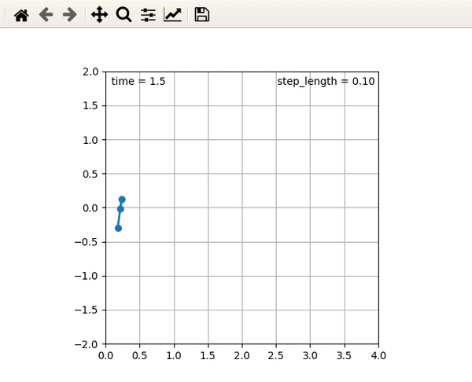

# Inverted-Pendulum-Model-Trajectory-For-Biped
A Spring Loaded Inverted Pendulum (SLIP) model based framework for generating walking trajectories for bipeds.
It is a dynamic online trajectory generator which can handle varying step lengths in the motion.

Stop and Step Length are two parameters that need to be passed at every step. Step length will be changed at every phase change and the trajectory will come to a halt when Stop is True.

**There are some initial parameters that need to be set, information about them is present in the init() function of slip class and slip_sl.py file.**

The slip_sl.py file returns transformation matrices for base, left foot and right foot in world frame. It also returns the binary code for leg which is in swing phase (0 for right and 1 for left) along with base velocity.

The files are python script, each file has following functions -:
  1) slip.py - Contains the slip class which generate trajectories, call step function with time as a variable to execute the next step
  2) test.py - A file to load the slip class and print the output in form of base, right foot and left foot transformation matrices along with some other parameters
  3) plot.py - Plots the 2D motion with time of the centre of mass and feet of the model

To test the trajectory generator, run the test.py file - 
```
python3 test.py
```
To Plot the top view of the feet and base, run the plot.py file - 
```
python3 plot.py
```

Here is the plotting of the trajectory in 2D - 
<p align="center">

 <p align="center">
 <i>Top View of the Trajectory with changing step length.</i><br>
</p>

**Dependencies**
> numpy, matplotlib

This code is implemented based on the following papers - 

  1) [The Linear Inverted Pendulum Mode : A simple modeling for a biped walking pattern generation](http://users.dimi.uniud.it/~antonio.dangelo/Robotica/dissertations/helper/3D_Linear_Inverted_Pendulum_Model.pdf)
  2) [Real-time 3D walking pattern generation for a biped robot](http://users.dimi.uniud.it/~antonio.dangelo/Robotica/2012/helper/K0529.pdf)
